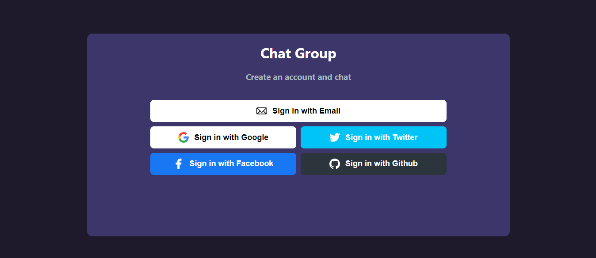

# Chat Group

This a Chat group where you can:

- Create a new channel with a name and a description.
- Select a channel of my choice
- Select a channel, I am added as a member of the channel
- Can see member of the channel
- Can send a message
- Can see other people's messages
- Can search for a group

## App Screenshot

# ¿How Works?

Require Node.JS 10+

- `npm install` for install al dependencies.

- `npm run dev` for development environment.

- `npm run build && npm start` for production environment.
